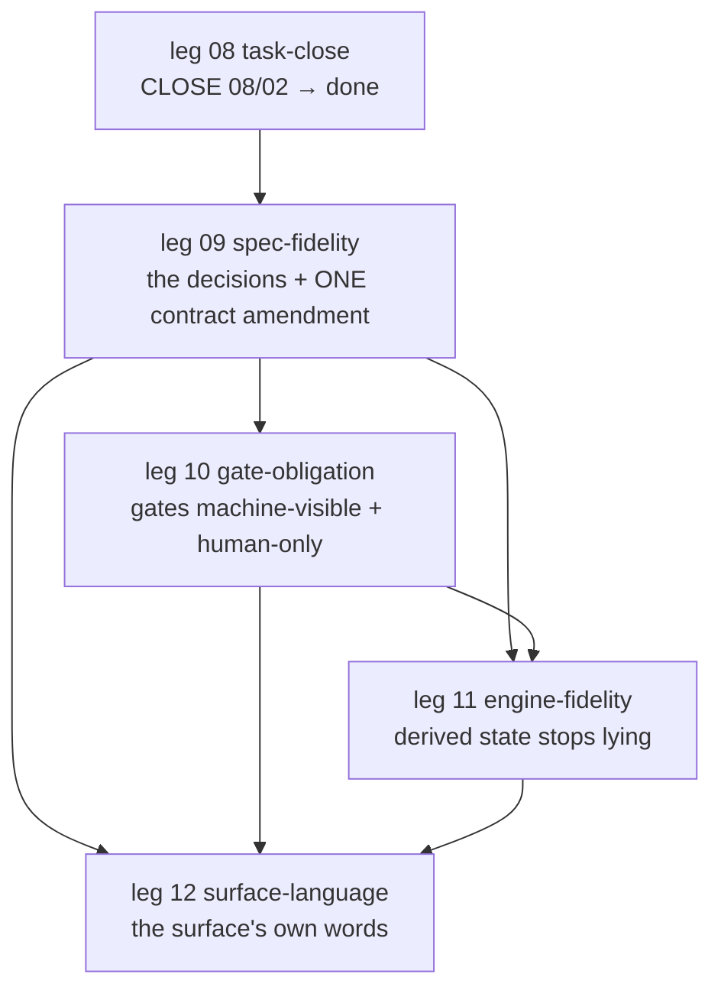

# Design-Fidelity Plan — bringing the implementation and the design back into agreement

**What this file is.** A SCRATCH plan (`.agents/`, never journey scope, never an artifact). The
record of this work is the JOURNEY — the legs/tasks below are what gets spawned with `spawn!`; this
file only exists so the next session (or the human) can see the order, the dependencies and the
open decisions before anything is spawned. Delete it once its legs are spawned, or leave it as
working state (it is invisible to state either way).

**Authority.** `docs/` (in force) > this file. Where this file and a contract disagree, the
contract wins — and the disagreement is a finding for leg 09.

**Baseline verified at plan time** (2026-09-11, read-only; commands actually run):

| Fact | Evidence |
|---|---|
| Leg 08 `08-task-close`: `08/01` done, `08/02` **`accepted`** (confirm gate accepted + `evidence.commits[]` present) | `ann journey`, `ann detail 08-task-close/02-…` |
| Suite green | `npm test` → 36 files, **587 tests passed** |
| No gate gaps, no F-AC18/F-AC19 problems | `ann check` → `OK — 13 docs in the manifest, no gate gaps` (1 warn: `distance-to-goal`) |
| No store drift | `ann verify` → `clean — 0 drifts` |
| Repo + full git history contain **no** API key | 351 commits scanned by value: 0 hits |
| The leaked key is live in **4** agent-session transcripts **outside** the repo | scan by value: 2× `~/.pi/agent/sessions/…`, 2× `~/.claude/projects/…` |

---

## 1. The shape — four legs, sequential and gated

**(leg numbering shifted, 2026-09-11):** the journey DEFERRED leg 09 (`09-spec-fidelity/01-validate-decision-forks` — the D1-D11 decisions stay recorded here and return as their own later epic) to open the goal's server/UI slot, so `10-server-ui` was spawned FIRST and the fidelity legs below are now **11-gate-obligation · 12-engine-fidelity · 13-surface-language** — the `10 / 11 / 12` labels in this file (and in the D-table's "gates leg N" references and OPS-3) are the ORIGINAL numbering.

Legs are sequential (`legGateMet`: every task of the previous leg must be **closed** before a new leg
can spawn). Within a leg, tasks are siblings and may be parallel; the shipped reality is one leg at a
time. New leg numbering starts at **09**.



Hard dependencies (not just the tool's ordering):

- **09 → 10**: the gate code embodies the human-ness mechanism (D2), which leg 09 decides.
- **09 → 11**: every leg-11 code change embodies a decided contract (D1 · D4 · D6 · D7 · D8) which leg 09's amendment records.
- **10 → 11**: task `11/05` (frame close path) lands in the frame that `10/01` (FIX-3) rewrites — same file, same seam. Do not run them in parallel.
- **10 → 12**: the surface vocabulary/descriptions must reflect the settled gate model.
- **09/01 → 09/02**: the amendment writes down what 01 decided.
- **12/01 → 12/02, 12/03**: the vocabulary forks gate their own implementation.

### Step 0 — close leg 08 (nothing else can start before this)

| # | Action | Verify |
|---|---|---|
| 0a | `npm run ann -- complete! 08-task-close/02-implementation-close-commands --note '…'` — the confirm gate is accepted and evidence exists, so `complete!` is the sanctioned close (gate decides, command completes) | `ann journey` → `08-task-close done` |
| 0b | Commit the journey write (`.ann/journey/…` — the store; `journey` is a symlink to it) | `git status` clean for `.ann/journey` |
| 0c | Leg-gate review by the human: does leg 08's epic (cancelled terminal + honest status + close commands) hold? | the human's word; then `spawn! 09-spec-fidelity …` |

**Expected right after 0a:** `ann next` reports the goal consult (`journey exhausted — verdict
UNCONFIRMED: …`), **not** `advance-leg` — every spawned leg is now `done`, so `advance()` finds no
non-done leg and consults the goal. That is the correct mid-session state, not a defect: the next leg
does not exist yet.

So the leg + its first task are **hand-authored spawns**, by design: `advance!` never spawns on
`advance-leg` (the authored-work boundary, flow-control v7 §5), and with no non-done leg it proposes
nothing at all. `spawn! 09-spec-fidelity '<leg contract>'` passes the leg gate because leg 08 is closed;
`ann next` then reads `advance-leg: leg gate MET … spawn tasks into 09-spec-fidelity`.

---

## 2. Leg 09 — `09-spec-fidelity`

**Epic / gate ACs (the leg root's contract):**

- AC-1: every open decision that blocks code (D1–D8) is decided, recorded with provenance, and the deciding human is named.
- AC-2: exactly **ONE** coherent amendment lands the whole reconciliation — the contract stack is internally consistent, and each claim in it is either implemented or explicitly marked as a target.
- AC-3: no code change rides this leg; the deliverable is `docs/` content.
- AC-4: the amendment's claims are each checkable against the shipped code, and every stale path/vocabulary named by the review is resolved one way or the other.

### `09/01-validate-decision-forks` (workType `validate`)

**Delivers:** the decision record — each fork answered, with the option chosen, the rationale, the
alternative rejected and why, and the exact doc sections the answer changes. Human-facing grill; the
human's gate①(/gate②) accept is the decision.

**ACs (sketched):**

- AC-1: forks **D1–D8** (§4 below) are each answered in the record; no fork is left implicit, and no fork is answered "both" without naming which is normative.
- AC-2: each answer names the doc sections it changes and the code slice (if any) that embodies it — so the amendment and the code legs cannot drift.
- AC-3: provenance per the ladder (`discussed` for every high-impact fork; a `defaulted` answer is flagged, never silently accepted).
- AC-4: any fork the human deliberately defers is recorded as an open decision with a named owner and the slice it blocks.
- AC-5: committed as `<sha>` with evidence; the record itself is the commit-cited doc (or an `evidence` record naming it).

**Depends on:** nothing (this IS the decision elicitation). **Blocks:** 09/02 and the code legs.

### `09/02-implementation-contract-amendment`

**Delivers:** the contract stack, amended in place — one pass, one coherent story. (Per the v15 rule
this is one cohesive deliverable: "the contract stack is reconciled"; split per doc only at the grill
if the human prefers one doc per task.)

**ACs (sketched), one clause per doc:**

- AC-1 — **`journey-format-spec` (v18):** §14/§7 (F-AC18) record **docs-as-git** — a conclusion is `evidence.commits[]` only; the "locked document OR commit evidence" alternative and the "produced nothing records the reason" escape are replaced by the real successor (`cancelled` + REQUIRED `reason`); §3's vocabulary gains **`cancelled`** (with its REQUIRED `reason`) and **`accepted`** as recorded words with their status semantics; §17's goal-root event list is corrected to what the writer actually allows — the seed (`created`+`completed`, `seedGoal` only), `goal-met`, and the one-off self-disabling `meta-refactor:` evidence — and the **goal.md "artifact-locked … (hash-checked immutability)" claim is resolved per D3**; §16.4's rework rule is restated per D1 so it no longer contradicts flow-control §3; the stale `00 → .` compat-symlink notes are corrected (the symlinks are gone — commit `6e36c62`); the event schema records the wall-clock field per D5.
- AC-2 — **`flow-control-spec`:** §3's gate obligation is stated to the level the code enforces AND to the level it does not (the FIX-1..5 obligations land here once leg 10 ships; this amendment states the settled model from D2 and marks the rest as the target), and §3's rework routing is made consistent with D1.
- AC-3 — **`core-design`:** the retired `lock!` / `supersede!` vocabulary (lines ~29/53/59) is replaced by the shipped surface (`evidence!`/`complete!` and the docs-as-git conclusion), §2's `openQuestions` read-path claim is corrected to name the paths that were actually fixed, and the frame's close path is described per D8. `src/kernel/steps/index.ts` → the real path (`src/flow/steps/index.ts`).
- AC-4 — **`architecture`:** the write list drops `lock!`/`supersede!` (line ~59) and the "today's `src/kernel/` / `src/engines/`" note (line ~107) is replaced with the real `src/` layout; the event-schema bullet stops listing retired vocabulary as live.
- AC-5 — **`functional-spec` (v3):** the F-table is reconciled with the derived surface — F1 (`ann init`) → the shipped project/goal-entry path, F2 (`ann idea`) → the goal-session path, F4/F11/F12 (`ann validate` / `ann history` / `ann artifact`) → the shipped reads, F16/F17 → the shipped `check`/`config`; any row that is a genuine future function is marked as one, not left looking shipped.
- AC-6 — **`resource-registry`:** §9's migration list is corrected — #2/#4/#5/#6 marked executed or re-scoped, **#1 is stale under v16** (the `docs/` category/placement semantics are retired), **#3 resolved per D7**; @5's register gains any new row this amendment creates.
- AC-7 — **Hygiene:** `KNOWN-ISSUES.md`'s "accepted baseline, 15 problems" section is stale (`ann check` now reports **zero** problems) — corrected or deleted; `docs/tree-format-spec.md` (the pre-rename "rounds" doc, still in the manifest) is either retired from the manifest or explicitly marked historical (human call at the grill).
- AC-8: the docs index is regenerated (`ann docs --write`), the manifest and the in-force docs are committed, and the same commit carries the `evidence` record; `ann specs` shows the new versions.
- AC-9: nothing in `src/` changes in this task — it is the docs half only.

**Depends on:** 09/01. **Blocks:** all of legs 10–12.

---

## 3. Leg 10 — `10-gate-obligation`

**Epic / gate ACs:** the gate obligation is machine-visible and human-only — the entry gate exists
from spawn, a gate write requires a recorded human, the frame can only LAND on a gate card, and a
check rule makes the regression detectable. (This epic was authored once as
`.agents/gate-obligation/09-leg.json` + `09-task-01.json`; the ids must be re-prefixed to `10-…` and
the targetAreas extended with this plan's additions. The authored contracts are the source for the
AC wording below.)

### `10/01-implementation-gate-obligation`

**Delivers:** the five fixes + this session's additions, in one slice.

**ACs (sketched — the authored FIX-1..FIX-5, plus additions):**

- AC-1 **entry gate visible:** `spawn!` ends by recording `submitted @ grill` **through the existing `submit!` path** (no new mechanism, no direct store write) — a fresh task derives `blocked`, appears in `LookBack.pendingGates`, and `run!` stops `blocked-at-gate` before any execute step. Tests: spawn→blocked; spawn→`next` lists the pending grill gate; `run!` stops at the gate.
- AC-2 **gate writes human-only:** `gate!` refuses the automated default exactly as `goal! met` does, per the **D2** mechanism (whatever leg 09 decided: the refusal, the identity source, the TTY posture), and the decider is stamped on the record. Tests: the refusal writes NOTHING; a named human succeeds.
- AC-3 **interactive seam:** the frame's gate path refuses NON-TTY stdin (`echo accept | ann run!` can never decide a gate) and, on a real TTY, carries the human identity from the interact channel; on the operator path `run!`/`advance!` LAND on a blocked-at-gate card the human then `gate!`s — the frame stops writing `submit!`+`gate!` on the human's behalf. Tests: non-TTY refuses; `run!` leaves the gate undecided (no `confirmed` written).
- AC-4 **discipline pinned to the human:** AGENTS.md states it concretely — the operator presents the card, ONLY the human runs `gate!`, no agent (operator included) records a gate decision for the human, the spawn ritual ends at `submit! … grill` + the card, and **agents quote a fresh `ann next`** when reporting gate state (never a remembered one).
- AC-5 **scripted detection:** a check rule flags an agent-initiated gate decision (and/or a `confirmed(grill)` landing in the same write burst as `created` with no intervening presentation) — a rule module with tests, present in the derived registry, with explicit grandfathering for pre-cutoff history.
- AC-6 **`submit!` gains a note channel:** `ann submit! <id> <gate> [confirmedSha] --note '<text>'` (the command already threads `note`; the CLI does not) — with a strict-flag refusal like `evidence!`'s, so a typo cannot land as a sha.
- AC-7 **the dead twin:** `src/surface/command-renderers.ts:158`'s stale "all spawned tasks done" branch — remove it or make it consume the same `CLOSED_TASK_STATUSES` truth as the fixed `renderPlan`, so the two cannot disagree again.
- AC-8 **verification:** suite green (new tests per fix), `npm run build` clean, `ann check`/`ann verify` clean on this repo, `flow-control-spec` §3 + the resource-registry register amended for what ships, committed with evidence.

**Depends on:** 09/01 (D2) and 09/02. **Blocks:** 10/02, 11/05, leg 12.

### `10/02-implementation-wallclock-stamps`

**Delivers:** a wall-clock stamp on every event, so same-day gate reports can be ordered and
reconciled (today `at` is `YYYY-MM-DD`, and two same-day decisions are indistinguishable).

**ACs (sketched):** the single writer stamps the field per **D5** (recommended: an ISO-8601 UTC `ts` on every event, informational — append order remains the ONLY order, never a sort key); the field is schema-validated (absent on legacy events, never a hard failure) and surfaced where a human compares same-day decisions (`detail`/`branch`/the gate card); tests for the writer + a legacy-event read; docs already amended by 09/02. **Depends on:** 09/02 (D5) and 10/01 (shared writer file — land 01 first).

---

## 4. Leg 11 — `11-engine-fidelity`

**Epic / gate ACs:** the shipped engine's derived state, validation and reads stop contradicting the
contracts — every claim in leg 09's amendment has a producer, and no derived view contradicts another
in the same output.

### `11/01-implementation-openquestions-shape`

**Delivers:** openQuestions become a validated, load-bearing field instead of an inert blob.

**Findings this lands (verified):** `spawn` only checks "is an array" (`commands/index.ts:302-303`) —
entry shape is unchecked; readiness and impact are derived from `q.blocking` (`flow/materialize.ts:119,140`)
while the **live** node `04-grilling-architecture/01-implementation-portable-areas` declares
`impact: "high"` → `ann packet` prints `[medium]` and `readiness: ready`; and two read paths still use
the retired nested location (`flow/validators/rules.ts:241`, `surface/command-renderers.ts:192`), which
`core-design` §2 claims were corrected.

**ACs (sketched):**

- AC-1: the entry shape is validated at `spawn!` (a closed field set; a named, failing message) per **D4** — the canonical shape is ONE of `impact` / `blocking`, with the other derived or explicitly lifted as a legacy alias, and `context-packet-spec` §2 vs §3 (which today specify the two different shapes) are reconciled in the same pass.
- AC-2: a high-impact question actually GATES: a task whose canonical flag says high derives a non-ready packet / a blocked-ish readiness and is named in the blocker string. Test: the live shape (`impact: 'high'`) blocks — a regression test that would have caught today's `readiness: ready`.
- AC-3: both stale read paths fixed (`rules.ts`, `command-renderers.ts`) with a test per path, and the `[high]/[medium]` render agrees with the gating decision.
- AC-4: suite green; `ann packet 04-grilling-architecture/01-implementation-portable-areas` shows the truth (this task is the counter-example test); committed with evidence.

**Depends on:** 09/02 (D4).

### `11/02-implementation-confirmedsha-binding`

**Delivers:** the gate②→commit content binding, per **D6** — either a real producer + comparator, or
the claim withdrawn from the three docs (which would then be a 09/02 edit, and this task disappears).

**Verified today:** `submitted.confirmedSha` exists as a validated, plumbed, test-covered **field** —
but nothing in the frame ever sets it and nothing ever compares it (`grep confirmedSha` over `src/`:
store validation + command plumbing + one renderer only), while `journey-format-spec` §3/§14,
`core-design` §2 and the store's own error text all claim the frame recomputes and refuses on mismatch.

**ACs (sketched):** the producer exists (the confirm-gate submission records the sha of the presented bytes) AND the comparator exists (commit recomputes over the same source, mismatch → `failed` with a named blocker) — or, per D6, the three claims are deleted and the field is documented as reserved; either way a test proves the chosen posture (mismatch refuses, or the claim is absent from the docs).

**Depends on:** 09/02 (D6) and 09/01.

### `11/03-implementation-rules-registry`

**Delivers:** `rules/check/rules.json` stops being a write-only lie. **Verified:** the file holds **15** rules, the module registry holds **12** — the 3 extra (`one-current-per-name`, `resolution-files-exist`, `artifact-hash-integrity`) are retired by v16/docs-as-git.

**ACs (sketched):** regenerate via `ann rules --write` and commit (the derived registry is checked in, so it must match its source), or delete the file if the derived view is not meant to be committed — the option chosen is recorded on the task; a test or check asserts file-vs-module agreement so the drift cannot return silently. **Depends on:** 09/02.

### `11/04-implementation-ladder-rung-flags` — **conditional on D7**

**Delivers:** resource-registry §9's migration #3, per D7 — either the ladder rungs gain `enabled`
(and a real consumer in the decide registry) or the row is **withdrawn** (recommended) and this task
does not exist. **Verified:** `rules/decide/rules.json` has no `enabled` flags and no consumer reads a
decide registry; `rules/check/rules.json`'s `enabled` flags are consumed (`validators/index.ts:46`), so
the check registry is a real precedent for the shape. **Depends on:** 09/01 (D7), 09/02.

### `11/05-implementation-frame-close-path`

**Delivers:** one close path, or a deliberate duplicate made safe — per **D8**. **Verified:** the frame
ends a task by appending `completed` itself (`src/flow/frame.ts` ~509) after re-implementing
`complete!`'s preconditions (its own commit-evidence check), while `complete!` owns the same
preconditions. `08/02` AC-2 recorded "the frame untouched", so changing it reopens a recorded decision → D8.

**ACs (sketched):** either the frame routes its terminal through the `complete!` command (one set of preconditions, one place to fix) or the duplication is recorded as deliberate in `core-design` §2 with an agreement test (the two paths refuse/accept identically on the same tail states); plus the frame's derived-state honesty — the `run!`/`next` report and the actual tail agree. **Depends on:** 10/01 (same seam + FIX-3 semantics), 09/01 (D8).

### `11/06-implementation-doc-truth`

**Delivers:** two stale truths corrected outside the contract stack. **Verified:** `AGENTS.md:70` ends
`--check verifies artifact hashes and flags uncommitted tampering` — hashes are retired and the drift
read is `ann verify` (which today reports `clean`); `KNOWN-ISSUES.md` claims an accepted 15-problem
baseline and `ann check` reports zero.

**ACs (sketched):** AGENTS.md's state-protocol line names `verify` (and `ledger`) for drift/hashes and stops implying `check` does it; `KNOWN-ISSUES.md`'s stale section is corrected to reality (or folded into leg 12's docs pass — see the note in §7). **Depends on:** 10/01 (so the read vocabulary in the text matches what ships) — *or* land the AGENTS.md line immediately in leg 09 if the human prefers the lie gone sooner (it is one line; the trade is touching AGENTS.md twice).

### (candidate) `11/07-implementation-next-gate-truth` — the `next` report contradicts itself

**NOT in the review list — found while planning.** Numbered as a candidate slice: the human may
instead fold it into `10/01` (same renderer family) or `11/05` (same derived-state honesty epic) — say
so at the spawn.

`ann next` today prints, in one screen:

```
  active leg: 08-task-close (accepted)
  leg gate: MET
  advance: closure-needed — leg gate UNMET: 1 done, 0 blocked, remaining not done …
```

Both are derived correctly (`LookBack.legGate` = `store.legGateMet(activeLeg)`, which answers "is the
**predecessor** leg done?"; `advance()` asks "is the **current** leg closed?"), but the renderer labels
the first "leg gate" inside the active-leg block — the same class of derived-state lie fixed in
`98b99cf`. Fix: label it "previous-leg gate" in `next`, or report the current leg's closure state in
that line. **ACs (sketched):** one screen cannot contain two contradictory leg-gate statements; a renderer test asserts it for a mid-leg state. **Depends on:** nothing decisive; same file family as 10/01.

---

## 5. Leg 12 — `12-surface-language`

**Epic / gate ACs:** the surface speaks in the user's words — the read vocabulary is settled and
distinct, the gate state has a whole-journey view, and the command descriptions say what the user
gets rather than what event they write.

### `12/01-validate-vocabulary-forks` (workType `validate`)

**Delivers:** the settled read/write vocabulary + the naming record. **ACs (sketched):** **D9** (the `check`/`validate`/`verify` overlap), **D10** (`run!`/Frame naming) and **D11** (`ann gates` + the description voice) each answered with the reason; the answers name every surface touch-point (`--commands` table, README, AGENTS.md, the renderers); the naming history is recorded — `submit!` was renamed to `present!` and back (`8d77552` → `429bcbf`, the submit/cancel pair) and **no live doc carries `present!`** today, so the amendment records the settled name + why, rather than fixing a stale mention.

### `12/02-implementation-vocabulary-refresh`

**Delivers:** the settled vocabulary applied — per D9/D10: the command table, README, AGENTS.md, the renderers, and the contract docs that name the reads; and the **description audit**: today's `--commands` descriptions are written from the event's perspective ("REFUSES the composite-owned kinds (created/submitted/confirmed/rejected/goal-met)…") — rewritten in user terms (what the user gets / what is refused and why), for every command. **ACs (sketched):** every renamed/changed read has its calls, tests and docs updated; the table is regenerated from the derived source and README re-checked against it (the parity test that `98b99cf` restored); descriptions contain no bare event names; suite green; committed with evidence. **Depends on:** 12/01, 10/01, 11/01.

### `12/03-implementation-gates-view`

**Delivers:** `ann gates` — the whole-journey gate view (if D11 = yes): every undecided submission, each leg's gate state, the goal verdict, one screen — the human's work queue for the gate loop leg 10 hardens. **ACs (sketched):** the view is a derived read (no writes), covers all legs, marks the frontmost-ready action, is `--json`-capable, is in the derived command table + README, has tests against a mid-journey fixture and the exhausted-session case. **Depends on:** 12/01 (D11) and 10/01 (the gate model it reports).

---

## 6. The decision forks — the human decides, the plan does not

Each fork below is **answered by the human** (in `09/01`, or `12/01` for the surface ones). The
"waits" column is what cannot start until it is answered. Recommendations are the plan's opinion only.

| # | Fork | Options | Recommendation | Waits |
|---|---|---|---|---|
| **D1** | **Rework semantics** — `journey-format-spec` §16.4 ("a rework is a new superseding sibling, never an edit") vs `flow-control-spec` §3 + `core-design` §2 (same node, `runId` advances, same gate). The code implements the latter. | (a) §16.4 wins → rework becomes a new sibling task: changes the frame's LOCKED routing, §3, and every rework test. (b) flow-control wins → §16.4 is corrected. (c) **BOTH are right at different scopes** — §16.4 is the TASK-level rule (a rejected *task* is not edited; the remedy is a new task), flow-control §3 is the ATTEMPT-level rule (a rejected *attempt* re-runs in the same task, `runId` advancing). | **(c)** — it is the only option that needs no code change, and it is what the engine actually does. Name both scopes explicitly in ONE place and cross-reference. | If (a): an unplanned leg-11 task `rework-routing` appears (re-opening LOCKED routing + its tests) and 11/05's seam work grows. If (b)/(c): only 09/02 edits. |
| **D2** | **Gate human-ness** — how does a gate decision become *machine-visibly human*? Today `gate!` has **no** who/interactivity check at all (`commands/index.ts:346-374`), while `goal! met` refuses the `agent` default. AGENTS.md's rule ("if a rule matters, it is a scripted rule") is violated. | (a) refuse the automated `agent` default on gate writes, like `goal! met`. (b) additionally require a TTY (an agent-driven subprocess has none). (c) an `operator` identity stored in the user config **outside the repo** (`~/.ann/config.json`, chmod 600) — but note an agent with shell access can write that too. (d) accept that in-band human-ness is **not provable** and say so, coupling the strongest cheap signals to a scripted detection rule. | **(d) built from (a)+(b)+(c):** fail closed on the automated default · refuse non-TTY gate writes · a configured operator identity as the *recorded* decider · a detection rule for burst-suspicious decisions · and the contract states plainly that this is a discipline + detection boundary, not proof (the real identity arrives with the web/server slice, where the credential lives server-side). | `10/01` FIX-2/FIX-3 entirely; `11/05` (same seam); `11/06`'s text. Do NOT start leg 10 before this is decided. |
| **D3** | **goal.md "hash-checked immutability"** — `journey-format-spec` §17 claims goal.md is "artifact-locked on the goal leg root (hash-checked immutability)"; the code allows **no** goal-root artifact-lock (docs-as-git, `store.ts` `goalRootEvent`: only `goal-met`), and the manifest carries no shas. §17 even contradicts itself. | (a) give the manifest/index shas and verify them (`docs/manifest.json` → `{path, sha}`, `ann specs` shows it) — a real integrity check for git content. (b) drop the claim; goal.md is git content, its integrity is git's, and the seed is the only writer. (c) both: drop "artifact-locked" and add the manifest sha as a *docs-index* fact (not a lock). | **(c)** — honest about the mechanism (no lock) while keeping a cheap, checkable sha (git already has the bytes; the manifest is generated, so the sha can never drift). | 09/02's §17 text. |
| **D4** | **The openQuestion entry shape** — `context-packet-spec` §2 specifies `{blocking, defaultIfUnanswered}`, its §3 specifies `{impact, default, provenance, status}`; `journey-format` §2 says `blocking: true` gates; the engine derives `impact` from `blocking` and validates neither. The live node uses `impact: 'high'` and does not gate. | (a) canonical `blocking: boolean`; `impact` derived/lifted. (b) canonical `impact: high|medium|low`; `blocking` derived (`impact === 'high'`). (c) keep both, validated, with a reconciliation rule. | **(b)** — it matches the packet spec's *output* shape and the live nodes, and "high impact" is the word the review/prose already uses; lift `blocking: true` as a legacy alias in the read path. | `11/01` AC-1/AC-2. |
| **D5** | **Wall-clock timestamps** — every event's `at` is `YYYY-MM-DD` (`today()` everywhere), so same-day gate reports cannot be reconciled. | (a) an ISO-8601 UTC `ts`, informational (append order stays the only order). (b) a per-node monotonic `seq`. (c) status quo + accept same-day ambiguity. | **(a)** — cheapest, no ordering semantics smuggled in (which would contradict F-AC14 / format §3), and it is exactly what the human needs to reconcile a day's decisions. | 09/02's format text; `10/02`. |
| **D6** | **`confirmedSha`** — the spec'd gate②→commit content binding has **no producer and no comparator** in the frame today (the field, the plumbing, the validation and the store's own error text all exist; the two ends are missing). | (a) build it (the frame records at gate②; commit recomputes and refuses on mismatch → `failed`). (b) drop the claim from §3/§14 + `core-design` §2 and mark the field reserved. | **(a)** — build it. It is a small producer+comparator over a file the frame already handles, and the alternative is deleting a guarantee a human was told they had. If cost matters more, (b) is defensible ONLY with the docs corrected in the same pass. | `11/02`; 09/02's text either way. |
| **D7** | **resource-registry §9 migration #3** — ladder rungs gain `enabled` flags (`block: true`, others `false`) "so the ladder is data"; nothing consumes a decide registry today. | (a) implement (flags + a consumer). (b) withdraw the row as a dead-config smell. | **(b)** — the registry's own rule is that a word nothing derives is a no-op (`cancelled`/`accepted` rows), and there is exactly one implemented rung; adding five inert flags is the death this spec exists to prevent. Record the withdrawal and the reason in §9. | `11/04` disappears on (b); 09/02's §9 text either way. |
| **D8** | **The frame's close path** — the frame appends `completed` itself (frame.ts ~509) and re-implements `complete!`'s preconditions; `08/02` AC-2 recorded "frame untouched". | (a) one path — the frame routes through the `complete!` command. (b) keep the duplicate, record it as deliberate, add an agreement test. | **(a)** — two copies of a precondition is the drift class this whole plan exists to kill. It is a reopening of a recorded decision, so the reopening is named. | `11/05`. |
| **D9** | **The read vocabulary** — `check` (integrity + gates + manifest), `validate` (rule findings), `verify` (drift). Overlapping names; AGENTS.md's protocol already blurs them. | (a) merge `validate` into `check` (`--rules`), keep `verify`. (b) rename `validate` → `lint`. (c) leave the three, document the distinction precisely. | **(a)** — three reads with two of them named "check-ish" is the surface telling the user the same word twice. | `12/01` → `12/02`. |
| **D10** | **`run!` / "Frame" naming** — the docs call the engine's task-runner "the frame"; NFR/prose calls the executable party "the runner". | (a) rename the concept to "the runner" everywhere, keep `run!`. (b) keep "Frame" as the internal component name and "runner" for the party, stated once. | **(b)** — cheapest, and it is already the usage in the docs (`runner-review`, "the runner has not committed yet"). | `12/01` → `12/02`. |
| **D11** | **`ann gates`** (a whole-journey gate view — the human's work queue) and the description voice. | (a) add `ann gates`. (b) don't — `next` already lists `WAITING ON YOU`. (c) add it *inside* `next`. | **(a)** — `next` answers "what runs next"; the human's question is "what is waiting on ME, across the whole journey" (today: only the active leg's pending gates). It is a derived read, cheap, and leg 10 makes it the load-bearing loop. | `12/01` → `12/03`. |

---

## 7. Verification — the bar every slice must pass

**Shared bar (all slices, no exceptions):**

```
npm run build            # tsc clean
npm test                 # 587 baseline (36 files) + the slice's new tests, all green
npm run ann -- check     # no NEW problems; no gate gaps; the state line reads truthfully
npm run ann -- verify    # 0 drifts
git commit + evidence!   # structured commit evidence naming the commit(s)
submit! … confirm        # then the HUMAN decides the gate
```

**Per slice, the check that proves the slice (the test that would have caught the finding):**

| Slice | The proof |
|---|---|
| 09/02 | `ann specs` shows the new versions; every claim the amendment makes is grep-able in `src/` or marked "target"; no retired vocabulary (`lock!`/`supersede!`/`src/kernel`/`present!`) remains in `docs/` |
| 10/01 | spawn→blocked (the entry gate is visible) · `RECORDED_BY=agent gate!` refuses and writes nothing · non-TTY refuses · a burst decision is flagged by the new rule, and the rule does not fire on grandfathered history |
| 10/02 | two events written the same day carry distinguishable wall-clock stamps; a legacy event without the field reads fine; append order is unchanged |
| 11/01 | `ann packet 04-grilling-architecture/01-…` no longer prints `readiness: ready` with a high-impact question open; the entry-shape validation fails named on a bad shape; both stale read paths have a test |
| 11/02 | per D6 — a mismatch between the presented and committed bytes refuses (test), or the claim is provably absent from every doc |
| 11/03 | file rules == module rules (an assertion, not a convention) |
| 11/05 | the frame's terminal and `complete!` agree on every tail state (one path, or an agreement test) |
| 11/06 | no doc names a retired read/mechanism |
| 11/07 | one `ann next` output cannot contain two contradictory leg-gate statements (renderer test) |

*(Leg 11 therefore holds six committed slices plus the candidate `11/07`; if the human folds it, five.)*
| 12/02 | the command table is derived, README matches it (parity test), no description contains a bare event name |
| 12/03 | `ann gates` is a read (no writes in the diff), covers all legs, `--json` parity |

**Per leg (the leg gate):** all tasks closed (done/superseded/cancelled) → the leg derives `done` →
the human reviews the epic's gate ACs → `spawn!` the next leg. Leg 09's AC-3 is the strongest one to
check honestly: **no code change may hide inside the docs leg.**

---

## 8. Operations

| # | Item | Owner | Note |
|---|---|---|---|
| **OPS-1** | 🔴 **Rotate the LLM API key.** Verified: the configured key (the `deepseek` one in `~/.ann/config.json`) is in **4** agent-session transcripts outside the repo (2× `~/.pi/agent/sessions/…`, 2× `~/.claude/projects/…`); the repo and its **351-commit history are clean** (0 hits by value). | **the human** | Rotate at the provider → `ann config! set apiKey <new>` → re-scan. The old value becomes inert once rotated; optionally redact the 4 files (recommended — it stops the value living on in transcripts). |
| **OPS-2** | Re-run the leak scan **by prefix pattern** (`sk-`, `dsk-`, `api[_-]?key`) and not only by exact value — the review counted ~9 files and one already redacted; a truncated/escaped/quoted copy would not match the exact-value scan. | the human / an agent | Do this right after rotation; the scan is read-only. |
| **OPS-3** | Re-prefix the authored gate-obligation contracts: `.agents/gate-obligation/09-leg.json` → the `10-gate-obligation` leg, `09-task-01.json` → `10/01-implementation-gate-obligation` (ids inside the JSON too), and extend `targetAreas` with `src/surface/command-renderers.ts` (AC-6/AC-7), the AGENTS.md report-discipline line (AC-4), and `docs/flow-control-spec.md`+`docs/resource-registry.md` (AC-8). | at spawn | Scratch contracts, never journey scope — the spawned node's own `node.json` is the authority once spawned. |
| **OPS-4** | `.agents/plan/design-fidelity-plan.md` is working state: delete it (or leave it) once legs 09–12 are spawned. It is never named in a contract's `targetAreas`, and never a journey record. | at spawn | Per AGENTS.md, scratch dirs are never journey scope. |
| **OPS-5** | `.agents/artifacts/*.html` + `.agents/context/` are untracked scratch (visible in `git status`). No action required; do not commit them, and do not add them to scope. | — | Observed while planning; nothing depends on them. |

---

## 9. Already closed / corrections to the findings list

Honest bookkeeping: things the review listed that I verified are **not** open, or are different from
the description.

- **Finding 15 (OBS B leftovers)** — **closed.** The `evidence!`/`complete!` strict-flag fix landed in `98b99cf` (unknown `--flag` → named usage error, exit 2) and is test-covered (`src/surface/__tests__/handlers.test.ts`, +142 lines). Nothing to plan.
- **Finding 16's `present!` mention** — no live doc/table/README carries `present!` today (the rename `8d77552` was reverted by `429bcbf`); the item is therefore "record the settled name", not "fix a stale mention" (folded into 12/01/12/02).
- **Finding 23/`KNOWN-ISSUES.md`** — the review did not list it; I found it stale: it claims an accepted 15-problem `check` baseline, and `ann check` today reports **zero** problems and `ann verify` **zero** drifts (folded into 09/02 AC-7 / 11/06).
- **resource-registry §9 migration #1** — executed (vocab `artifactTypes` does carry `category`/`versioned`) but rendered **moot** by v16 (the `docs/` placement layer it describes is retired). Folded into 09/02 AC-6.
- **Finding 9's live case** — the disabled question is `impact: "high"`, not `blocking: true`; the reason it silently passes is that the engine reads only `blocking`. Stated in 11/01 so the fix targets the real cause.
- **NEW finding 11/07** — `ann next` prints `leg gate: MET` and `advance: … leg gate UNMET` in the same screen (two different leg-gate questions, one label). Same class as the derived-state lie fixed in `98b99cf`; added as a slice.

---

## 10. What can start immediately vs what must wait

**Immediately (no decision needed):**

1. **Step 0** — close `08/02` (`complete!` + the journey commit) → leg 08 done.
2. **OPS-1/OPS-2** — the key rotation + the broader leak scan (the human's action, independent of all of this).
3. **Leg 09 spawn** + `09/01-validate-decision-forks` — the decision elicitation is the first work item and it needs nothing but the human.
4. **OPS-3/OPS-4** — the scratch-contract re-prefix and the plan-file cleanup, at spawn time.

**Waits on a decision (A) — do not start:**

- `10/01` (the whole gate-obligation build) waits on **D2**.
- `11/01` waits on **D4**; `11/02` on **D6**; `11/04` on **D7**; `11/05` on **D8**; any rework code on **D1**.
- `10/02` waits on **D5** — and on 09/02 (the format text).
- `09/02` (the amendment) waits on **D1, D3, D5, D7**, and on `09/01`'s record of them.

**Waits on a merge (not a decision):**

- `11/05` and the `11/07` fix land in the seam `10/01` rewrites → strictly after `10/01`.
- `12/02`/`12/03` land after `10/01` (they describe the gate model it settles).

**The critical path:** `08/02 close → 09/01 decisions → 09/02 amendment → 10/01 gate obligation → 11/05 frame close → 12/02 vocabulary` — with `11/01 → 11/03 → 11/06` running inside leg 11 alongside.
